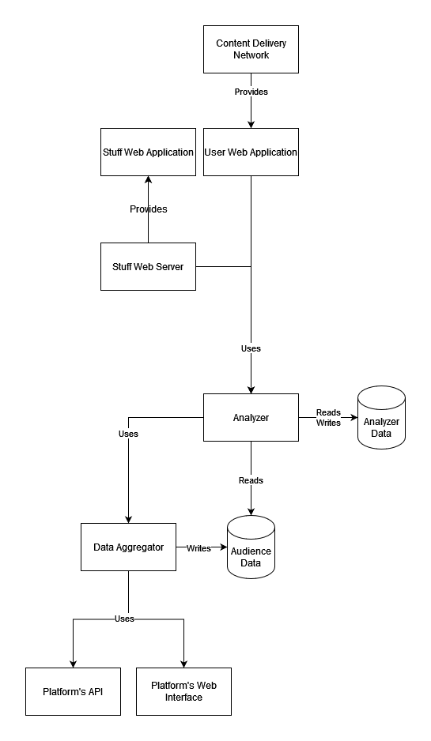

# XAudience Project

## Description
A service that provides statistics, metrics, insights based on audience data from various social networks.

## Details
Planned platforms to support: currently Telegram only, also Twitter is in question due to its API policy, Discord looks suitable to start support it, but still needs research.

How a user can interact with the service: through the user web interface or through a bot, if the platform provides this feature.

### Use Cases
- A user can explore audiences
- A user can inspect a specific audience
    - Audience preferences
- A user can see the audience comparison
    - Count of mutual audience
    - General audience preferences
- A user can see an interactive graph of audiences

*The term audience in this context means channel, account, group, etc.*

## System Design

