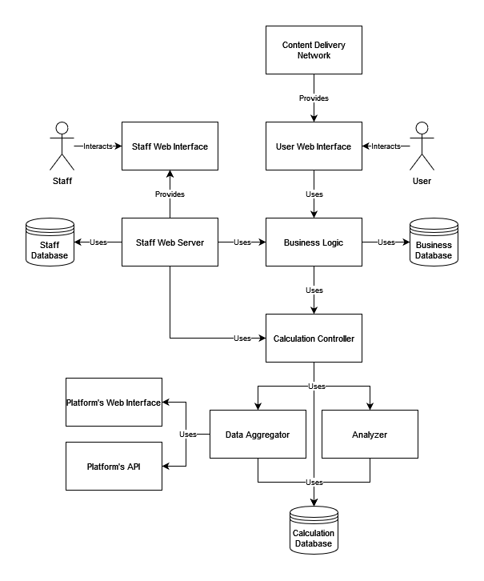

# XAudience Project

## Description
A service that provides statistics, metrics, insights based on audience data from various social networks.

## Details
Planned platforms to support: currently Telegram only, also Twitter is in question due to its API policy, Discord looks suitable to start support it, but still needs research.

### Goals
Create platform-agnostic and scalable analytics service that preserves the anonymity of users.

### Use Cases
- A user can explore audiences
- A user can inspect a specific audience
    - Audience preferences
- A user can see the audience comparison
    - Count of mutual audience
    - General audience preferences
- A user can see an interactive graph of audiences

*The term audience in this context means audience of a channel, account, group, etc.*

## System Design
The system design is divided into 3 layers: the presentation layer also known as a frontend, the business layer, which is backend for the frontend, and the compute layer, which contains microservices that do some calculations or computations for the business layer.

### User Web Interface
A lightweight web application that allows the user to use the services.

### Staff Web Interface
Allows staff to monitor and control internal systems.

### Staff Web Server
Watches all internal systems, collects statistical data, logs errors and other useful info.

### Business Logic
Processes user logic, acts as a backend for user web interface.

### Calculation Controller
Acts as a middleware between business logic and calculation services.

### Analyzer
Analyzes audience data and writes results to the calculation database.

### Data Aggregator
Collects, parses, scrapes raw data from social network or another type of social platform and writes it to the calculation database.

## Decisions
Since the libraries for working with platform APIs are implemented using different technologies, it's a good way to use the libraries natively, without any bindings or interactions with the ABI or FFI. Therefore, data aggregators implementations depends on the platform API library technology.
